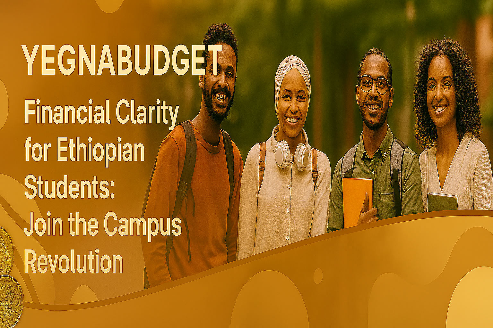
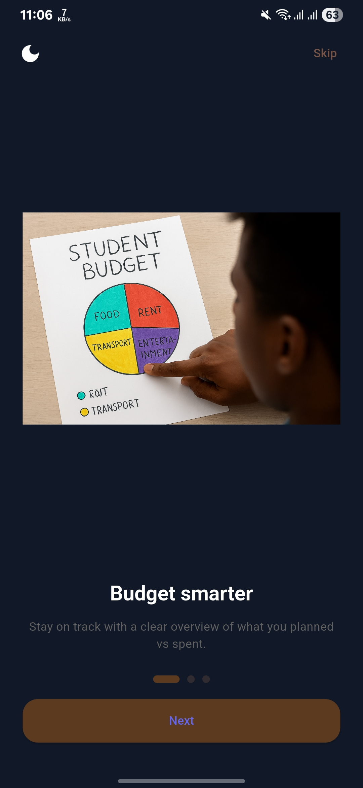
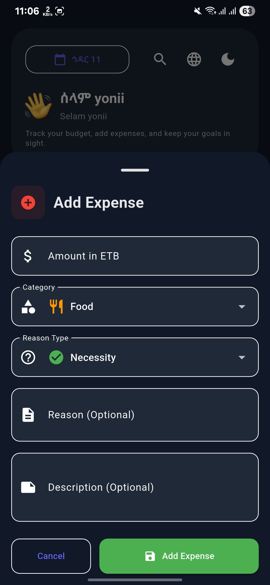
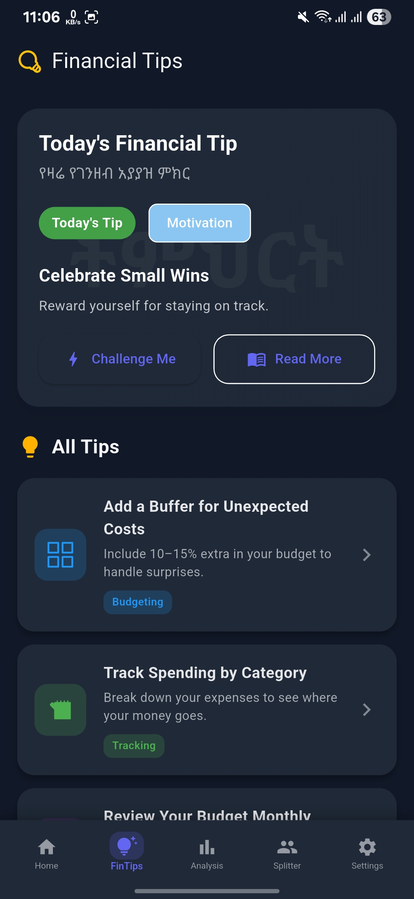

# YegnaBudget: Empowering Financial Clarity for Ethiopian Students

  
*Your journey to financial confidence starts here – A digital guide for mindful spending.*

---

## 🌟 Welcome to YegnaBudget: A Story of Empowerment and Purpose

Imagine being a university student in Hawassa, juggling classes, social life, and daily expenses — yet unsure where your money goes. Or picture a young adult striving to build better financial habits but lacking the tools to track and reflect. This is where **YegnaBudget** steps in, not just an app, but a companion for conscious living and financial growth.

YegnaBudget is a **Personal Expense Tracker and Financial Literacy App** built with Flutter, designed to help Ethiopian students and young adults manage their daily spending, build awareness, and develop sustainable habits. Created with a deep sense of cultural authenticity and user empathy, it’s more than a tool, it’s a movement toward financial empowerment.

> 📌 **This is my submission for the PLP Africa Final Project.**

---

## 🚀 What Makes YegnaBudget Shine? Key Features

YegnaBudget transforms how you engage with your money. Here's how it supports your journey:

- **Daily Expense Logging Made Simple** 📝: Add and categorize your spending with just a few taps, no clutter, no confusion.
- **Smart Notifications for Habit Building** 🔔: Get gentle reminders every evening to reflect on your spending and stay consistent.
- **Culturally Rooted Onboarding Experience** 🎨: Enjoy a welcoming splash screen with a brown gradient and strict Amharic script logo that feels authentically yours.
- **Visual Insights for Smarter Choices** 📊: View summaries and trends to understand where your money goes, and where it could go better.
- **Lightweight and Offline-Friendly** 📱: Designed to work smoothly even with limited connectivity, perfect for campus life.
- **Built for Students, by a Student** 🎓: Tailored to the real needs of Ethiopian learners, with features that grow with you.

With intuitive UI, SVG-enhanced visuals, and a focus on clarity, YegnaBudget is your trusted financial companion.

---

## 📖 The YegnaBudget Story: From Vision to Reality

Every meaningful app begins with a question. For YegnaBudget, it was: *How can I help students like me take control of their finances, and feel proud doing it?*

As a third-year Information Systems student and campus organizer, I saw firsthand how many peers struggled with budgeting. Inspired by the desire to build something practical, personal, and empowering, I began crafting YegnaBudget, not just to ship an MVP, but to master Flutter’s hardest concepts while solving a real problem.

The journey started with sketches and splash screen experiments, evolving through rigorous UI testing, Gradle troubleshooting, and SVG asset refinement. I focused on onboarding flow, mapped icons, and notification logic , ensuring every detail felt intentional and culturally grounded.

From debugging build errors to managing state in the app, this project reflects my commitment to both technical excellence and community impact. Today, on November 20, 2025, YegnaBudget stands as a symbol of student-driven innovation.

---

## 🖥️ Sneak Peek: YegnaBudget in Action

See how YegnaBudget brings financial clarity to your fingertips:

  
*Step into control: Our onboarding welcomes you with warmth and purpose.*

  
*Track and reflect: Clean UI for daily entries and monthly summaries.*

  
*Learn and change yourself: Clean UI for daily tips and financial lessons.*

  
*Scan to Download: Get the APK from Google Drive and start budgeting today!*

## 🙏 Heartfelt Acknowledgements

No journey is complete without gratitude. YegnaBudget was shaped by the support of inspiring individuals and organizations:

* **PLP Team** 💼: For providing a space to grow as a developer and offering a software development scholarship that significantly contributed to my learning and progress.
* **Mr. Allan Lenkaa** 🤝: As a Mobile App Development module lead in PLP Africa, thank you for helping me grasp real-world concepts and inspiring me to work on impactful projects.
* **Mr. Denamo Markos** 📘: Thank you for your guidance and belief in student-led innovation.
* **Ms. Ruth Abiti** 🌟: Your support helped me refine both the vision and the execution.
* **My Campus Volunteers** 👥: For testing features, sharing feedback, and helping shape the app’s soul.

*Made with ❤️ by Yonatan B.*  

